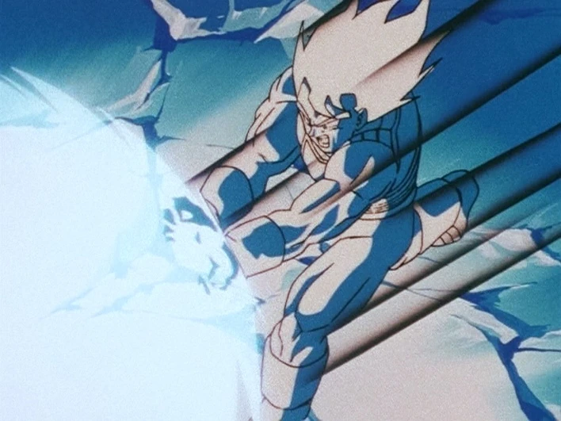

# Dragon Ball Z Kamehameha



Real-time webcam app that uses MediaPipe pose tracking to detect a Kamehameha-style hand pose and trigger Dragon Ball VFX overlays.

When your hands are close together, the app shows a charging effect. When your arm angle extends past a threshold, it switches to a firing beam effect.

## Features

- Real-time pose detection from webcam
- Gesture state machine: IDLE -> CHARGING -> FIRING
- Animated charging effect overlay
- Animated Kamehameha beam overlay
- Basic smoothing to reduce effect jitter

## Project Structure

- app.py: main application loop and pose logic
- pose_landmarker_heavy.task: MediaPipe pose model file
- assets/energy.mp4: charging effect video
- assets/kamehameha.mp4: beam effect video
- assets/dbz.webp: README preview image

## Requirements

- Windows, macOS, or Linux
- Python 3.11 recommended
- Webcam

Python dependencies are listed in requirements.txt.

## Installation

1. Clone or download this repository.
2. Open a terminal in the project root.
3. (Recommended) Create and activate a virtual environment.
4. Install dependencies:

```bash
pip install -r requirements.txt
```

## Run

```bash
python app.py
```

Press Q or Esc to quit.

## How Gesture Detection Works

1. The app tracks shoulders, elbows, and wrists with MediaPipe Tasks.
2. If both wrists are close, it enters CHARGING.
3. If wrist distance stays close and elbow angle is extended, it enters FIRING.
4. Effect position is smoothed and overlaid each frame using OpenCV.

## Controls

- Q: quit
- Esc: quit

## Troubleshooting

### ImportError: cannot import name runtime_version from google.protobuf

Cause: incompatible TensorFlow and protobuf versions.

Fix:

```bash
pip install "protobuf>=5.28.0,<6"
```

This repository already pins that range in requirements.txt.

### Camera does not open

- Close other apps using the webcam.
- Check OS camera permissions for terminal or Python.
- Try changing the capture index in app.py from 0 to 1.

### Low FPS or lag

- Reduce camera resolution.
- Close background apps.
- Use better lighting so pose detection is more stable.

## Notes

- First startup may take a moment while MediaPipe initializes.
- Warning logs from TensorFlow and MediaPipe are usually non-fatal.

## Credits

- MediaPipe for pose tracking
- OpenCV for rendering and video processing
- Dragon Ball inspired concept and VFX styling
